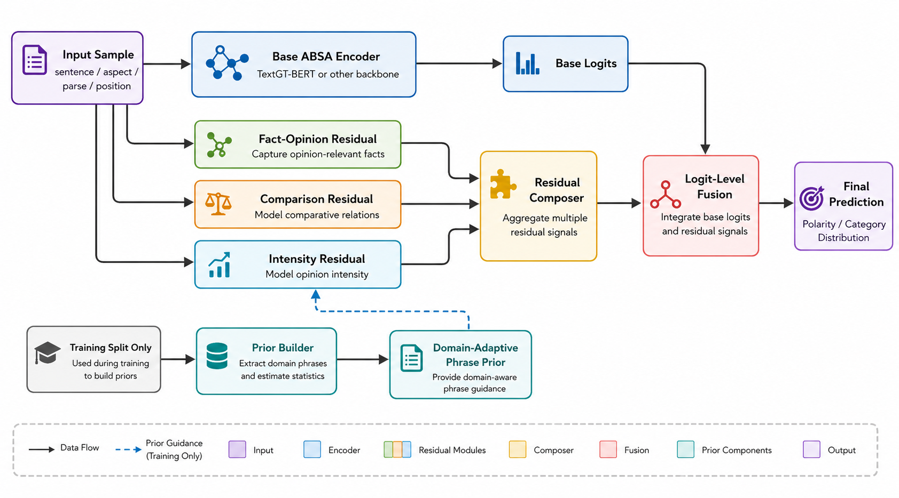
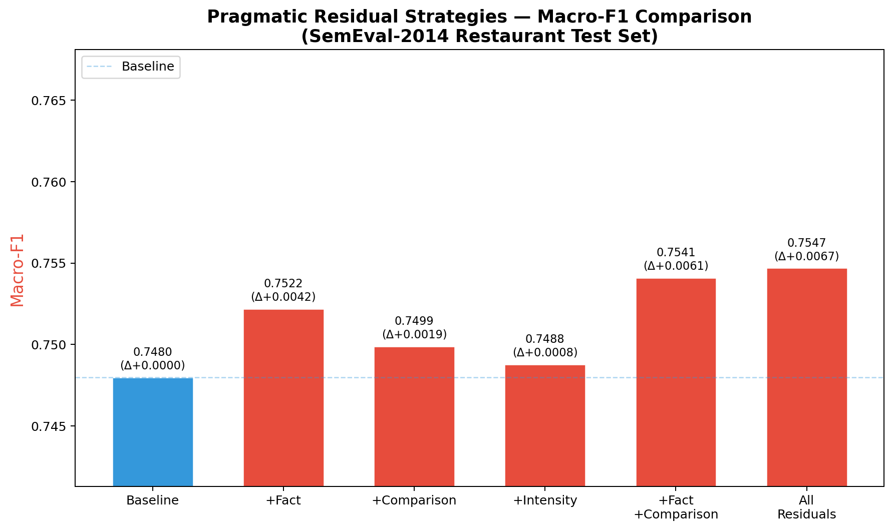
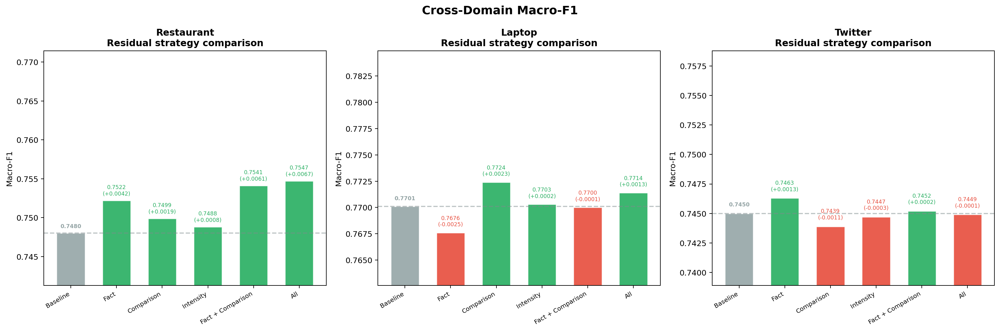
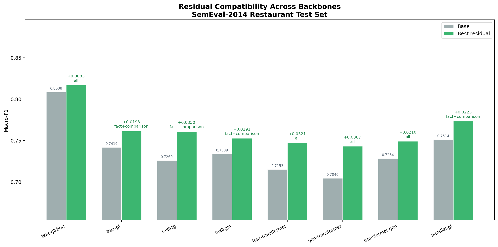

[English](README.md) | [简体中文](README.zh-CN.md)

# TriPR-ABSA

**面向属性级情感分析的三分支语用残差适配方法**

TriPR-ABSA 在已有三分类 ABSA 模型的输出端加入三个轻量残差分支。它不改动
骨干模型，而是针对事实与观点边界、比较方向和情感强度修正 logits。

[](https://github.com/LawrenceRiver/TriPR-ABSA/actions/workflows/ci.yml)


[](LICENSE)
[](https://github.com/shuoyinn/TextGT)
[](https://doi.org/10.1609/aaai.v38i17.29911)

## 与上游项目的关系

本仓库是 [shuoyinn/TextGT](https://github.com/shuoyinn/TextGT) 的独立研究分支。
实验以 TextGT-BERT 为主要基线，TriPR-ABSA 是叠加在基线 logits 之上的残差
方法。本项目由我们单独维护，不是 TextGT 的官方版本。上游代码和论文的归属
信息保留在 [NOTICE](NOTICE) 中。

## 架构



适配器读取骨干模型 logits 和一条解析后的样本，三个残差分支依次运行，组合器
在 logit 层累加修正量。这个软件包不会替换或重新训练骨干网络。接口、公式和
错误处理约定见 [docs/method.md](docs/method.md)。

## 方法

TriPR-ABSA 的类别顺序固定为 `positive`、`negative`、`neutral`。

### 事实

事实与观点分支检查当前属性附近是否以客观列举或描述为主。当基线给出正向结果，
但文本证据更接近事实陈述时，该分支会把预测向中性方向调整。

### 比较

比较分支判断当前属性在明确比较中占优还是处于劣势。它先处理方向词和外部参照，
再修正正向与负向 logits。

### 强度

强度分支匹配经过校验的训练集短语先验。短语作用域、局部否定、词距和当前属性
都会影响残差。没有提供先验时，该分支不作调整。

### 组合器

组合器按照 `fact`、`comparison`、`intensity` 的顺序运行选中的分支。每个分支
使用前一个分支输出 logits 对应的概率。公开接口包括
`apply_pragmatic_residual`、`apply_batch` 和 `load_prior`。

## Restaurant 已报告结果



SemEval-2014 Restaurant 主表采用三个入选检查点的平均值。机器可读数据保存在
[results/reported_metrics.json](results/reported_metrics.json)。

| 策略 | 准确率 | Macro-F1 |
| --- | ---: | ---: |
| 基线 | 0.8382 | 0.7480 |
| 事实 | 0.8406 | 0.7522 |
| 比较 | 0.8394 | 0.7499 |
| 强度 | 0.8388 | 0.7488 |
| 事实 + 比较 | 0.8418 | 0.7541 |
| 全部残差 | 0.8424 | 0.7547 |

<details>
<summary>跨领域与多骨干模型结果图</summary>





</details>

发布准备期间没有重新运行这些实验，因此这里不作最先进性能声明。各数据集的限制
和完整表格见 [docs/results.md](docs/results.md)。

## 安装

残差包支持 Python 3.9 和 3.10。

```bash
python3.9 -m venv .venv
source .venv/bin/activate
python -m pip install --upgrade pip
python -m pip install -e .
```

运行检查需要安装 `requirements-dev.txt`。完整的上游模型训练还需要
`requirements.txt`、数据集和模型资源。本仓库不重新分发数据集或预训练权重；
TextGT 基线的数据准备请按[上游说明](https://github.com/shuoyinn/TextGT#priliminaries)
操作。

上游代码和数据还引用了
[DualGCN](https://github.com/CCChenhao997/DualGCN-ABSA)、
[ABSA-PyTorch](https://github.com/songyouwei/ABSA-PyTorch) 和
[CDT_ABSA](https://github.com/Guangzidetiaoyue/CDT_ABSA)。
[SSEGCN](https://github.com/zhangzheng1997/SSEGCN-ABSA) 提供兼容的预处理数据。
从原始文本开始处理需要
[Stanford CoreNLP](https://stanfordnlp.github.io/CoreNLP/)；非 BERT 训练还会用到
[Stanford GloVe](https://nlp.stanford.edu/projects/glove/)。

## 快速开始

下面只启用比较分支，不需要短语先验。

```python
import torch

from pragmatic_residual import apply_pragmatic_residual

sample = {
    "text_list": ["I", "have", "had", "better", "food", "elsewhere", "."],
    "aspect": "food",
    "aspect_post": [4, 5],
}
logits = torch.tensor([1.2, 0.3, 0.1])

adjusted, details = apply_pragmatic_residual(
    logits,
    sample,
    modules=("comparison",),
    return_details=True,
)

print(adjusted)
print(details["actions"])
```

## 配置

`modules` 可以传入 `("fact", "comparison", "intensity")` 的任意子集。
设置为 `None` 时，三个分支按默认顺序全部运行。`prior` 可以是通过校验的映射，
也可以是 `scripts/build_phrase_prior.py` 生成的 JSON 路径。没有先验时，强度分支
自动停用。

先验构建器默认离线运行。只有显式选择 `--provider deepseek` 进行远程短语标注时，
程序才会读取 `DEEPSEEK_API_KEY`。推理、测试、可视化和离线构建都不需要密钥。

## 构建先验

构建器只读取训练集，默认模式不发起网络请求：

```bash
python scripts/build_phrase_prior.py \
  --train-file dataset/Restaurants_corenlp/train.json \
  --output artifacts/restaurant-train-prior.json
```

可选的 DeepSeek 标注只发送从训练集提取的短语候选和汇总计数，不发送完整数据行
或标签。密钥应通过进程环境提供，不能写进源码或提交到 Git 的配置文件中。

```bash
export DEEPSEEK_API_KEY="your-key"
python scripts/build_phrase_prior.py \
  --provider deepseek \
  --train-file dataset/Restaurants_corenlp/train.json \
  --output artifacts/restaurant-train-prior.json
```

使用远程提供方时，需遵守其隐私政策和服务条款。

## 可复现性

[docs/reproducibility.md](docs/reproducibility.md) 列出了 CPU 检查、上游 GPU 基线
命令、数据准备链接和离线先验构建命令。已报告指标直接保存在 JSON 文件中，
不从图片反推。

## 贡献者

TriPR-ABSA 由 Lawrence River、QCYTSN 和 jason0917-eng 共同维护。具体分工见
[AUTHORS.md](AUTHORS.md)。提交修改前请阅读 [CONTRIBUTING.md](CONTRIBUTING.md)；
私下报告安全问题和密钥处理要求见 [SECURITY.md](SECURITY.md)。

## 引用

[CITATION.cff](CITATION.cff) 同时记录了 TriPR-ABSA 软件信息和上游 TextGT
论文条目。使用本项目及其基线时，请分别引用两者。

## 许可证

[MIT 许可证](LICENSE) 适用于上游软件和本仓库的软件修改。第三方数据集、预训练
模型和 GloVe 资源继续使用各自的条款。项目原创图片的版权归对应贡献者所有；
具体归属和复用边界见 [NOTICE](NOTICE)。
